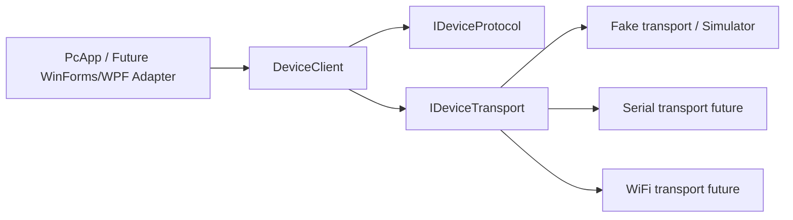

# Test-Bag (stabilization baseline)

This repository currently contains:
- **Legacy Windows desktop app** (`testbag-main/testbag-main/src/TESTBAG`) built with .NET Framework 4.8 WinForms.
- **Firmware projects** for Arduino/ESP32 using PlatformIO (`testbag-main/testbag-main/ArduinoAC`, `testbag-main/testbag-main/ESP32/*`).
- **New incremental refactor baseline** under `src/` + `tests/` that introduces a testable architecture (`Core`, `Transport`, `PcApp`, `DeviceSimulator`).

> This is **not a big-bang rewrite**. Legacy code remains intact while new boundaries and testable components are added.

## Inventory (Step 0)

```text
.
├─ src/
│  ├─ Core/                  # protocol, CRC, domain contracts, DeviceClient
│  ├─ Transport/             # swappable transport implementations (fake/loopback baseline)
│  ├─ DeviceSimulator/       # fake deterministic device process
│  └─ PcApp/                 # thin CLI host using DeviceClient
├─ tests/
│  ├─ Core.UnitTests/
│  ├─ Transport.IntegrationTests/
│  ├─ E2E.DesktopTests/
│  └─ HIL/
└─ testbag-main/testbag-main/
   ├─ src/TESTBAG/           # legacy WinForms app (.NET Framework 4.8)
   ├─ ArduinoAC/             # PlatformIO Arduino firmware
   └─ ESP32/ESPWIFI, ESPWITHEADC/ # PlatformIO ESP32 firmware
```

### Entrypoints and communication
- Legacy PC app entrypoint: `Program.cs` in `testbag-main/testbag-main/src/TESTBAG/`.
- Legacy app communication paths are mixed in UI (`frmMain.cs`) via serial, UDP, and HTTP clients.
- New baseline communication path:
  - `PcApp` (host/UI) -> `DeviceClient` -> `IDeviceTransport` + `IDeviceProtocol`.
  - Frame format uses STX/ETX and CRC16 (Modbus-style poly `0xA001`).

## Prerequisites (Step 1)

### PC app + tests (new baseline)
- .NET SDK 8.0+

### Legacy PC app
- Windows with Visual Studio 2022 (Desktop .NET workload)
- .NET Framework 4.8 targeting pack
- Any external dependencies currently referenced by legacy project (e.g., `MySql.Data.dll` path in old `.csproj`)

### Firmware
- Python 3.10+
- PlatformIO Core (`pip install platformio`)
- USB drivers for target board(s)

## Golden commands

### PC app (new baseline)
```bash
dotnet run --project src/PcApp/PcApp.csproj -- --device=fake
```

### Automated tests
```bash
dotnet test tests/Core.UnitTests/Core.UnitTests.csproj
dotnet test tests/Transport.IntegrationTests/Transport.IntegrationTests.csproj
dotnet test tests/E2E.DesktopTests/E2E.DesktopTests.csproj
```

### Firmware
```bash
platformio run -d testbag-main/testbag-main/ArduinoAC
platformio run -d testbag-main/testbag-main/ESP32/ESPWIFI
platformio run -d testbag-main/testbag-main/ESP32/ESPWITHEADC
```

## Architecture (Step 2)



### Responsibilities
- `Core`: pure domain logic and protocol encoding/decoding.
- `Transport`: transport abstraction and implementations.
- `PcApp`: thin host with configuration and state output.
- `DeviceSimulator`: deterministic fake device.

## Testing strategy (Step 3)
- Unit tests validate protocol encode/decode and CRC handling.
- Integration tests validate `DeviceClient` over fake transport.
- E2E tests spawn `PcApp` with `--device=fake` and assert state transitions.
- `tests/HIL` reserved for optional local real-hardware checks.

## CI (Step 4)
GitHub Actions workflow builds and tests the new baseline, and attempts firmware builds with PlatformIO.

## Troubleshooting
- `dotnet: command not found` -> install .NET 8 SDK.
- `platformio: command not found` -> `pip install platformio`.
- If legacy WinForms fails on non-Windows: expected, use Windows toolchain for legacy app.
